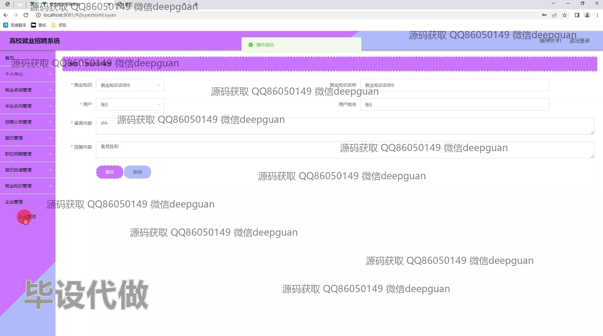

<h1 align="center">基于高校就业招聘系统设计和实现</h1>

## 简介
高校就业招聘系统：角色分为用户和管理员，用户功能包括个人信息管理、简历投递、职位申请及就业咨询；管理员功能包含招聘公告管理、企业管理、用户管理及求职意向管理，支持招聘数据统计与分析。    --计算机毕业设计源码；毕设源码；java毕业设计源码

## 联系方式

<h3 align="center">获取完整代码与数据库文件 + 微信：deepguan QQ: 86050149 QQ群: 783742310</h3>

<h3 align="center">可帮忙远程部署 包运行成功！提供远程部署、修改代码、设计文档指导、代码讲解等服务！</h3>

## 功能介绍（完整见运行截图）
用户：基本功能包括注册、登录和退出。用户可以在个人中心管理和编辑个人信息，包括简历号、用户名、密码修改、手机号、身份证、邮箱和求职意向等，提供头像上传功能。用户还可以浏览和投递简历，管理简历状态，查看投递记录，以及进行简历收藏和职位收藏。招聘相关功能允许用户查看职位详情、企业信息，参与招聘会，并与企业进行就业咨询。用户可查看和管理毕业去向，输入详细的就业数据如公司名称、位置、薪资等。系统还提供消息互动功能，包括就业咨询和招聘信息的获取。

管理员：管理员负责系统的整体管理，包括用户管理、招聘会管理、企业管理、毕业去向管理以及简历管理。管理员可以查看和操作全系统的用户信息及招聘咨询记录，创建和管理招聘公告、企业信息及用户留言。工作中涉及基本设置管理和求职意向的创建及管理。管理员主页包含统计分析功能，提供就业数据的可视化展示。通过系统提供的详细搜索和筛选功能，管理员能够有效处理各类数据操作，进行系统内的审查、详情查看、信息更新和删除等操作，确保系统运作顺畅。

## 运行截图

本代码来源于网络,仅供学习参考使用!

